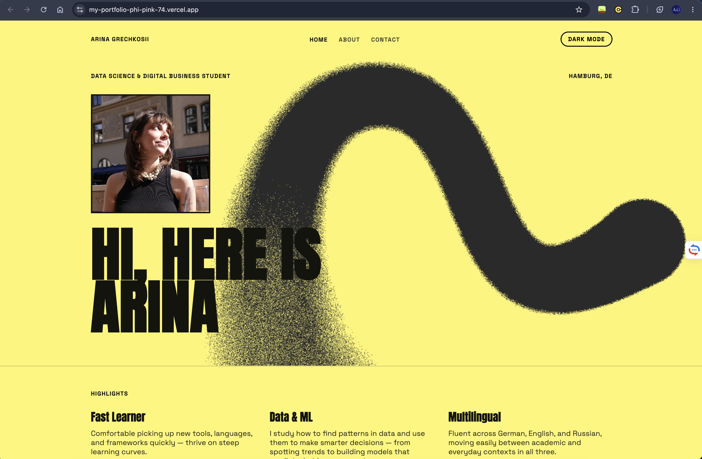
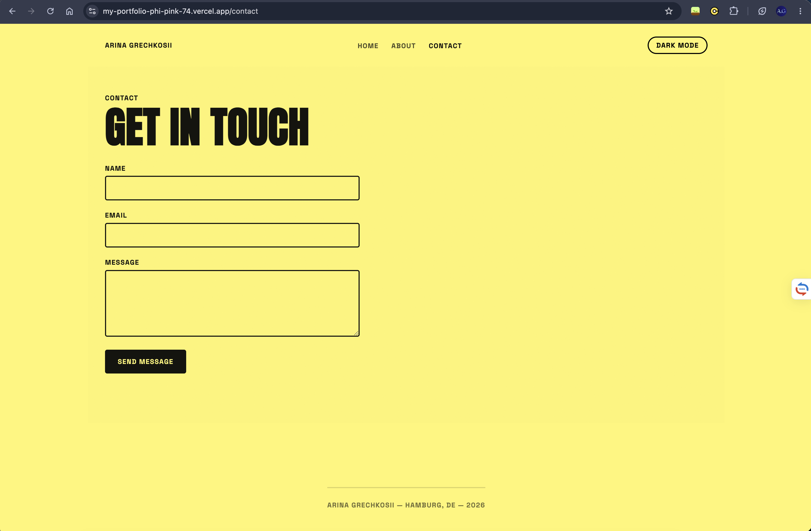
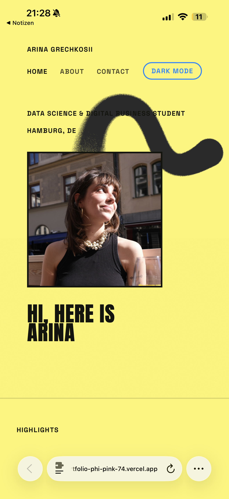
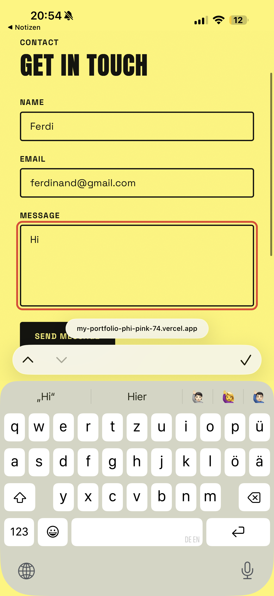
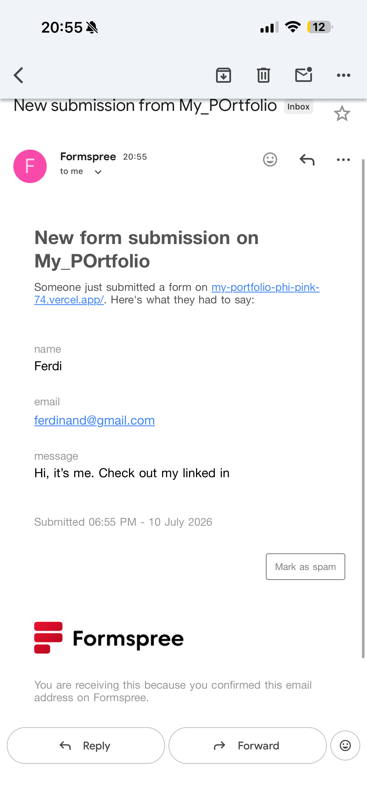
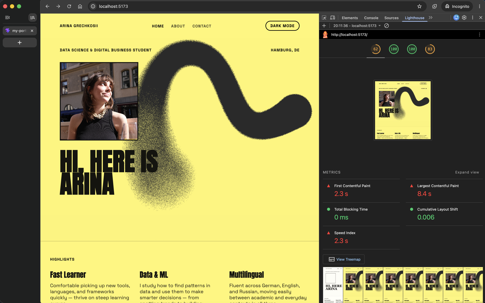
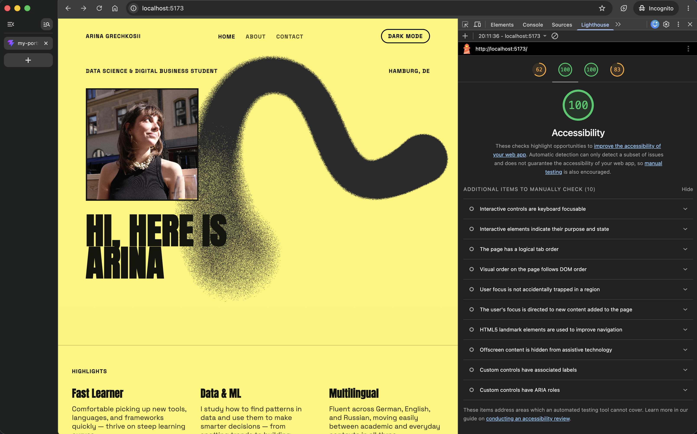

# Hi, I'm Arina Grecgkosii

This is my personal portfolio site, built for my Front-End Programming final project. It's a place to introduce myself, talk about what I'm into, and let people actually reach me through a contact form that works - not just a fake "message sent!" popup.

**Live site:** https://my-portfolio-phi-pink-74.vercel.app
**Repo:** https://github.com/arinagrechkosiy/my-portfolio

---

## How I built this

I started with a plain yellow background — bold, high-contrast, very "editorial poster" vibe. That felt too flat on its own, so I added a hand-drawn-style swirl graphic layered on top as a background image, which gave the hero section some texture and movement.

Then dark mode happened. Once I built the toggle, I realized the swirl image I'd made for light mode looked wrong against a dark background — the colors just didn't work anymore. So I ended up creating a second version of the background image specifically for dark mode, and swapping between the two depending on which theme is active. Small detail, but it took a bit of trial and error to get right.

The contact form was the part I cared about most — I didn't want it to just pretend to send a message. It's actually wired up through **Formspree**, so when someone fills it out and hits submit, I genuinely get an email. I tested it myself a bunch of times, including from my phone, to make sure it wasn't just a nice-looking dead end.

---

## Tech stack

- **React** (via Vite)
- **react-router-dom** for page navigation
- **Formspree** for the contact form backend
- Plain CSS with CSS variables, so the light/dark theme switch is just swapping variable values

---

## What's on the site

- **Home** — intro, my name/role/location, and a highlights section
- **About** — a short bio, my skills, and languages I speak
- **Contact** — a real form (Name, Email, Message) with:
  - Required-field validation
  - Email format checking
  - Minimum message length
  - Error messages that show up right next to the field that needs fixing
  - A genuine success confirmation once it sends
- **Dark mode toggle** — remembers your choice next time you visit, via localStorage
- Built to be responsive and to pass an accessibility audit cleanly

---

## A peek at the code

**Switching between pages** (`src/App.jsx`):

\`\`\`jsx
<Routes>
  <Route path="/" element={<Home theme={theme} />} />
  <Route path="/about" element={<About />} />
  <Route path="/contact" element={<Contact />} />
</Routes>
\`\`\`

**Remembering dark mode** (`src/App.jsx`):

\`\`\`jsx
const [theme, setTheme] = useState(() => localStorage.getItem('theme') || 'light')

useEffect(() => {
  document.documentElement.setAttribute('data-theme', theme)
  localStorage.setItem('theme', theme)
}, [theme])
\`\`\`

**Form validation that's actually accessible** (`src/pages/Contact.jsx`):

\`\`\`jsx
<input
  id="email"
  aria-invalid={!!errors.email}
  aria-describedby={errors.email ? 'email-error' : undefined}
/>
{errors.email && (
  
{errors.email}

)}
\`\`\`

---

## Screenshots

### Home

### About

### Contact

### Mobile — Home

That's the mobile view of the homepage — checked how everything reflows on a smaller screen.

### Mobile — testing the contact form

This is where I actually tested the contact form on mobile — filled it in with a test name and email like a real visitor would.

### Proof it actually sends

And this is the email I got back a minute later — so the form isn't just a nice-looking dead end, it genuinely delivers messages to my inbox through Formspree.

---

## Accessibility Audit

I ran a Lighthouse audit through Chrome DevTools to check everything was actually accessible, not just "looked" accessible.

Overall scores: 62 Performance (dev server, unoptimized — production build performs better), **100 Accessibility**, **100 Best Practices**, 83 SEO.

Zoomed into the Accessibility score specifically — clean 100, no automated issues flagged.

---

## Running it yourself

\`\`\`bash
git clone https://github.com/arinagrechkosiy/my-portfolio.git
cd my-portfolio
npm install
npm run dev
\`\`\`

Build for production:

\`\`\`bash
npm run build
\`\`\`

---

## Deployed on

Vercel, connected to this GitHub repo — every push to `main` auto-deploys.
